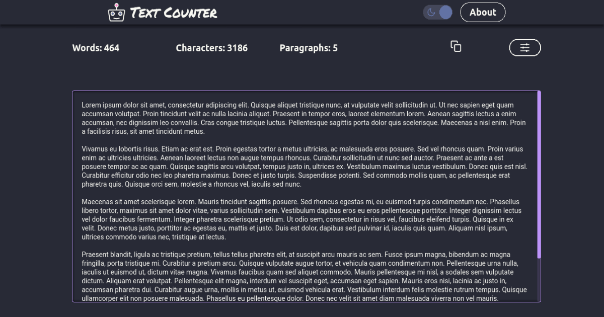

# Text Counter

This is a minimalist front-end application to help in the process of writing. It is available at [textcounter.tools](https://textcounter.tools).

## Features

- Display text properties
	- Number of words
	- Number of characters
	- Number of paragraphs
	- Letter density
- Theme switcher
	- Dark theme :purple_heart:
	- Light theme :yellow_heart:
- Save text to next visit

## Technologies

- [JavaScript](https://www.javascript.com)
- [TypeScript](https://www.typescriptlang.org)
- [React.js](https://reactjs.org)
- [Next.js](https://nextjs.org)
- [Styled Components](https://styled-components.com)